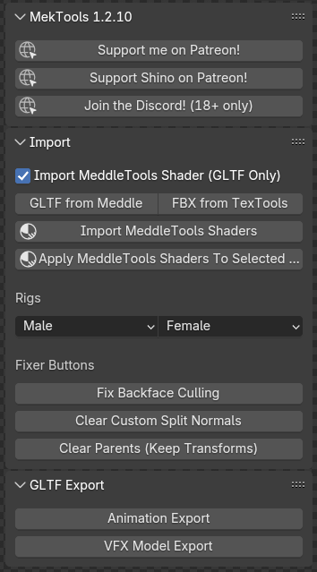
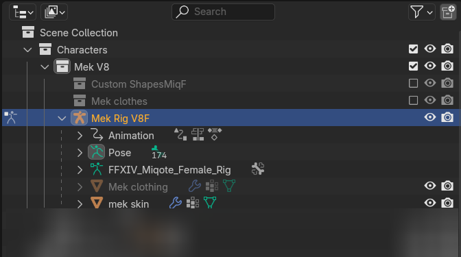
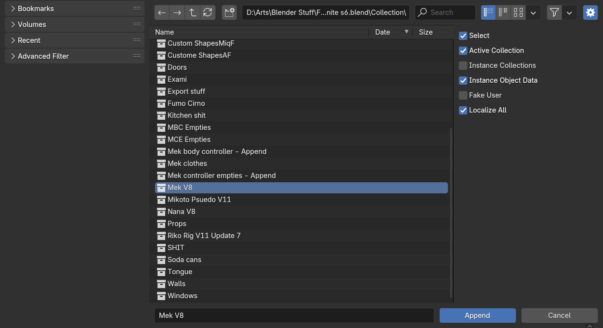

# Mektools-Version 1.7.3

The following is a bit outdated, as we are currently working on a 2.0 release with a nice wiki and guides we will make some rapid changes so the readme will maybe be a bit beglected. For help you can always visit the [Discord](https://www.discord.gg/98DqcKE)

please wait a bit while I organize a proper tutorial and place it here...

**Step 1:** Go to the green code button and hit Download ZIP (Do not unpack this)
**Step 2:** Open Blender 4.2.2 or later
**Step 3:** Go to Edit > Preferences > Addons > Install from disc...
**Step 4:** Go to the N Panel in the 3D Viewport to the Mektools tab...

Now you need to have something to import.

Assuming you already have Dalamud installed along with Mare, Penumbra, Glamourer and other required plugins...

Install [Meddle](https://github.com/PassiveModding/Meddle) This is needed for exporting assets from the game client.
Install [MeddleTools](https://github.com/PassiveModding/MeddleTools) This is needed for easy setup of shaders in blender of those assets!

On the Meddle UI, go to the Options tab, change Export type to RAW. This will export raw textures that are used in the shaders from Skulblaka. Then go to the Character tab, select your character and hit Export All Models.

It will prompt you with a window to select where you will be exporting the models and textures, pick somewhere you will remember.

**Step 5:** Go to Mektools tab and hit "GLTF from Meddle"
**Step 6:** Navigate to your character.gltf that was exported (or whatever you named it)
**Step 7:** wait for a moment because it will make blender look like that its frozen-- it hasnt lol.

After you've hit this point, the character will be imported and processed according to how I typically set up characters in blender.

The Append Shaders button will pull in the materials from the shaders.blend file, this is some shaders that all you need to do is replace the image textures with the ones that are for each part of your character.

**I will make a detailed video tutorial explaining how to import things and get gear to look proper too! just keep an eye out!**

The Rigs Male and Female buttons is used to manually append the Dawntrail Mekrigs to your scene. This is intended if you go to File > Import > GLTF or FBX and want to do things manually.

The button for Import GLTF from Meddle and FBX from Textools are both to set things up automatically.

Finally, Join the [Discord](https://www.discord.gg/98DqcKE) and ask any questions in the Help channel or share the cool stuff you've made with mektools!
If there are any issues found, please make sure you are using Blender 4.2 or higher and then send a message in the discord server for help.

Disclaimer: Do this in newly opened blender files for best results, if you have additional data in the blender file when importing, things might implode. If you want more than 1 character to be in the scene together after they've both been processed, select all of their mesh and the bones in Object mode, hit M to move the stuff to a new Collection, Name that collection the name of your character-- I like having mine set like this image below:

when I go to append my characters to another scene, I go to File > Append > Navigate to the Blend file they are located in > Collections and then click on this image below:

This will pull in characters from other files and keep their collections intact! ♥ ps you are cute ♥
